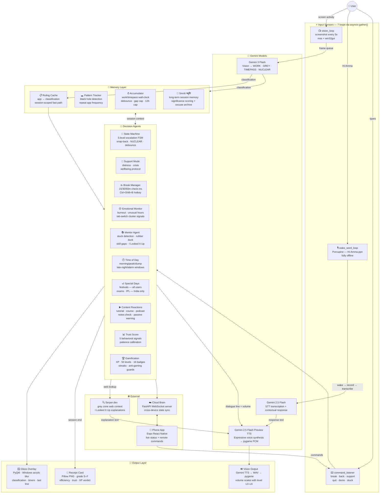
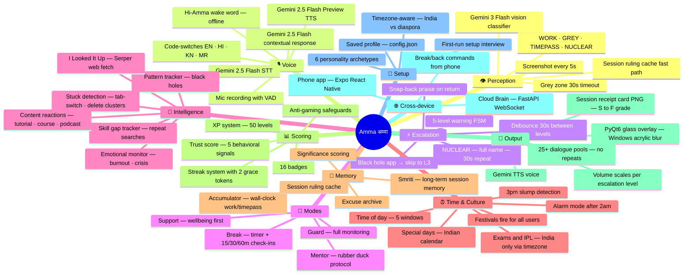

# Amma अम्मा — Architecture

Two views of the system. The flowchart shows how agents talk to each other. The mindmap shows every feature, grouped by what it does.

---

## Orchestration Flow

7 async loops run in parallel via `asyncio.gather()`. They share state through the memory layer and communicate via queues and direct calls. The orchestrator (`AmmaSession` in `main.py`) owns the session lifecycle.

---

## Feature Map

Every feature Amma has, grouped by what it does.

---

*For setup instructions, see [SETUP.md](SETUP.md). For the README overview, see [README.md](README.md).*
