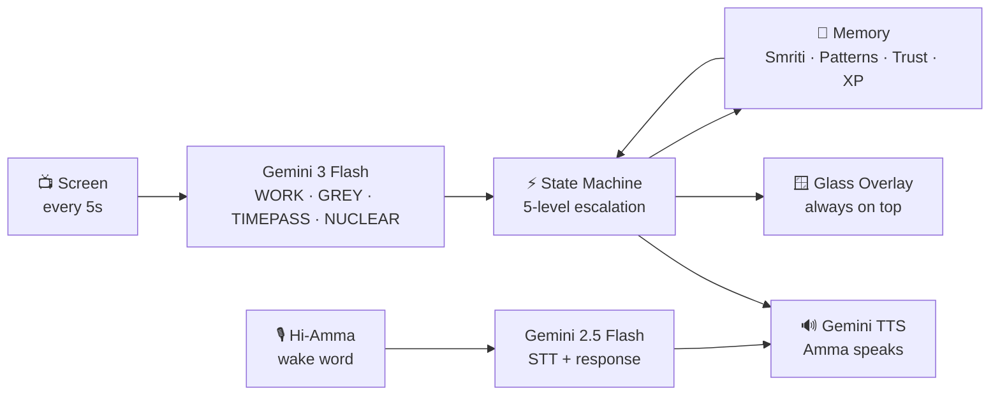

# Amma अम्मा

> *She is not here to serve you. She is here to raise you.*

Amma is an AI productivity guardian with the personality of a South Indian mother. She watches your screen every 5 seconds, classifies what you're doing, and will not let you fail — with love, guilt, and if necessary, a full SCREAM in three languages.

No stealth. No cheating. She is visible. She is always there. She is Amma.

---

## How It Works



> Full orchestration diagram + feature map → [Architecture.md](Architecture.md)

---

## What Amma Does

### Watches Your Screen
Every 5 seconds, Amma takes a screenshot and sends it to Gemini. She decides: are you working, wasting time, or somewhere in between? She tracks your window titles, your apps, your patterns. She misses nothing.

### Talks to You — Out Loud
Using Gemini TTS, Amma speaks with a warm, expressive voice that switches between English, Hindi, and Kannada depending on how serious things are getting. She starts gentle. She does not stay gentle.

Say **"Hi Amma"** and she listens — records your voice, transcribes it with Gemini STT, understands your context, and responds as Amma with full session awareness. Ask for a break, make an excuse, tell her you're stuck. She knows how much timepass you've had today.

### Escalates — Gradually, Then All At Once
Five warning levels. Each one worse than the last.

- **Level 1** — *"Beta, you've been on that for a while..."*
- **Level 2** — *"One hour. One whole hour of this."*
- **Level 3** — *"Close that tab. Right now. I am not asking."*
- **Level 4** — *"Do you understand what you are doing to your future?"*
- **Level 5 (SCREAM)** — *"YENU MAADTIDIYA?! BAND KARO WO ABHI!!"*
- **NUCLEAR** — Full name. 30-second repeats. No mercy.

### Rewards You Too
The moment you switch back to work — snap-back praise fires immediately. *"Nanna maga. I knew you would."* Two hours of clean work and she resets everything and tells you she's proud.

### Knows Your Patterns
Amma remembers which apps you keep going back to. After 3 visits and 30 minutes, that app is a **Black Hole** — and she skips the gentle warnings and goes straight to Level 3. She's seen this before.

---

## Personality

Six archetypes, chosen at first launch:

| Archetype | Vibe |
|---|---|
| **Classic** | Maximum guilt, zero chill, deeply invested |
| **Modern** | Updated references, occasional meme awareness, still screams |
| **Anxious** | Every notification is a potential crisis |
| **Competitive** | Everything compared to someone |
| **Philosopher** | Quotes before scolding. Long pauses. Devastating observations. |
| **Dadi** | Grandmother energy. Slower to anger, deeper disappointment. |

She code-switches naturally. Gentle in English. Firm in Hindi. Devastating in Kannada.

---

## Time & Context Awareness

Amma knows what time it is and adjusts accordingly.

- **7–9am** — Morning launch energy. Ambitious.
- **9am–12pm** — Peak hours. No nonsense.
- **3pm** — Slump detection. She notices.
- **After 10pm** — Late night mode. Stricter, then concerned.
- **After 2am** — Alarm mode. She stops caring about productivity and starts caring about you.

She also knows the Indian calendar. On Diwali, Holi, Ugadi — she eases up for everyone. Exam seasons and IPL are India-only and only activate if you're actually in India (set during first-run timezone setup). If you're in the diaspora, you still get the festivals, not the exam pressure.

---

## Modes

### Guard Mode (default)
Full monitoring. Classification every 5 seconds. Escalation active. This is most of your life.

### Support Mode
Something is wrong. Amma detects distress signals — unusual hours, output drops, sad music, isolation patterns. She pauses everything, switches to a softer voice, and just talks to you. No productivity pressure. Just presence.

### Break Mode
You said you need a break. She lets you. But she's watching the clock. At 15 minutes: check-in. At 30: firm. At 60: suspicious.

### Mentor Mode
You're stuck. She detects it — too many deletes, same search three times, tab-switching like you're lost. She offers the rubber duck protocol: *"Stop. Tell me in plain language what you are trying to make happen."*

---

## "I Looked It Up"

If you search for the same concept 4+ times, Amma notices. She stops you, tells you this is unacceptable, and then actually explains the concept — fetching a real explanation from the web via Serper. No more googling the same thing. She's handling it.

---

## The Glass Overlay

A floating, frosted-glass widget sits on your screen. Always on top. Always visible. Dark background, real Windows acrylic blur, Amma orange accent. It shows:

- Current classification (green / red / grey)
- Warning level bar (color-coded L0 → NUCLEAR)
- Work vs timepass timers and efficiency bar
- Current mode (GUARD / SUPPORT / BREAK)
- Last thing Amma said

Drag it anywhere. Double-click to collapse to a slim bar.

---

## Gamification (The Anti-Addiction Kind)

Amma tracks real work, not engagement. You can't game this.

- **XP** for valid work days, snap-backs, streaks — not for opening the app
- **50 levels** from *"The Beginner"* to *"Nanna Maga"*
- **16 badges** across achievement, cultural, and social categories
- **Streak system** with 2 grace tokens per month
- **Session receipt card** — a shareable PNG at the end of every session with your grade (S/A/B/C/D/F), stats, and Amma's verdict

---

## Session Memory (Smriti स्मृति)

Amma remembers. Every session is recorded — efficiency, warning peaks, trust level. Significant events (nuclear moments, 30-day streaks, breakthroughs) are stored with significance scores. She weaves these into future conversations naturally. She knows your history.

---

## Trust Score

Amma tracks how much she trusts you based on your actual behavior — snapback rate, nuclear frequency, work ratio, excuse accuracy, and consistency. High trust = more patience. Low trust = faster, harder interventions. You earn it back.

---

## Content Awareness

Amma knows the difference between watching a YouTube tutorial and doom-scrolling. Course open for 15 minutes: *"Are you actually taking notes, or just watching?"* Tech talk for 30 minutes: *"Are you going to apply any of this today?"*

---

## The Phone App

An Expo React Native app connects to the Cloud Brain over WebSocket. It shows your live session status on your phone — classification, warning level, timers, efficiency. Send break/back commands from your phone. Amma's voice interventions appear as messages in real time.

---

## Special Days

Amma knows the Indian calendar. On Diwali: *"Happy Diwali, beta! This is family time. Go."* During board exam season: *"Every student in India is studying right now. Every. Single. One."*

---

## Commands

| Command | What happens |
|---|---|
| `break` | Start break mode |
| `back` | End break, resume monitoring |
| `support` | Switch to Support Mode manually |
| `guard` | Return to Guard Mode |
| `stuck` | Trigger rubber duck protocol |
| `xp` | Print current XP, level, streak |
| `status` | Full session stats |
| `quit` | End session — summary + receipt card saved |
| `demo <minutes>` | Skip time forward (demo mode only) |
| `demo nuclear` | Trigger NUCLEAR immediately |
| `demo grey <app>` | Force a grey zone for any app |
| `demo end` | Trigger end-of-session |
| `demo reset` | Reset all accumulators |

---

## Architecture

```
main.py               — Orchestrator, command loop, session lifecycle
vision.py             — Screen capture (mss, 5s, multi-monitor, privacy exclusions)
classifier.py         — Gemini 3 Flash vision: WORK / GREY / TIMEPASS / NUCLEAR
accumulator.py        — Wall-clock time tracking (debounce, gap cap, 12h cap)
state_machine.py      — 5-level escalation FSM + snap-back + nuclear
dialogue.py           — 25+ dialogue pools, shuffle-reset, no repeats
voice.py              — TTS (gemini-2.5-flash-preview-tts) + STT (gemini-2.5-flash) + mic recording
overlay.py            — PyQt6 glass widget, Windows acrylic blur
config.py             — AmmaConfig dataclass, all personality knobs

personality.py        — 6 archetypes, first-launch setup interview
pattern.py            — Black hole detection, repeat app tracking
time_of_day.py        — Morning/peak/slump/late-night/alarm windows
support_mode.py       — Guard vs Support mode management
emotional.py          — Distress detection, burnout, crisis protocol, wellbeing score
mentor.py             — Stuck detection, rubber duck, skill gap, I Looked It Up
break_manager.py      — Break duration, check-ins, Ctrl+Shift+B hotkey
wake_word.py          — Porcupine custom wake word ("Hi-Amma" .ppn, offline detection)
gamification.py       — XP, levels, badges, streaks, anti-gaming safeguards
smriti.py             — Session memory, significance scoring, excuse archive
trust_score.py        — Behavioral trust (5 weighted signals)
content_reactions.py  — Educational content detection, notes check
special_days.py       — Indian cultural calendar, IPL, exam seasons
receipt_card.py       — Pillow PNG session summary card
serper.py             — Serper.dev web search (grey zone + I Looked It Up)
integrations.py       — Calendar, Gmail, Spotify, Notion models
deployment.py         — Onboarding, fallback classifier, structured logging
behavioral_signals.py — Phone-side risk scoring (privacy-safe)
phone_protocol.py     — Cross-device contradiction detection

cloud_brain/
  server.py           — FastAPI WebSocket server
  protocol.py         — Event protocol (OBSERVATION, VOICE_COMMAND, STATE_UPDATE...)
  state.py            — Redis-backed session state (in-memory fallback)

social/
  network.py          — Accountability pairs, leaderboard, Hall of Shame/Pride
  council.py          — Friend group verdicts (Hindi/Kannada/English)
  receipts.py         — Receipt data models

parent_portal.py      — Parent dashboard models, voice messages, WhatsApp nuclear

phone/
  App.tsx             — Dashboard: status, timers, commands, Amma messages
  src/services/CloudBrainClient.ts — WebSocket client, heartbeat, auto-reconnect
```

---

## Built With

- **Gemini 3 Flash** — Screen classification (vision)
- **Gemini 2.5 Flash Preview TTS** — Amma's voice output (expressive, low-latency)
- **Gemini 2.5 Flash** — STT transcription + contextual response generation
- **FastAPI + WebSockets** — Cloud Brain server
- **PyQt6** — Glass overlay (Windows acrylic blur)
- **Pillow** — Receipt card PNG
- **Expo / React Native** — Phone app
- **Serper.dev** — Web search
- **Porcupine** — Offline wake word detection ("Hi-Amma")

---

> *"I am not punishing you. I am raising you."*

For setup, see [SETUP.md](SETUP.md).
